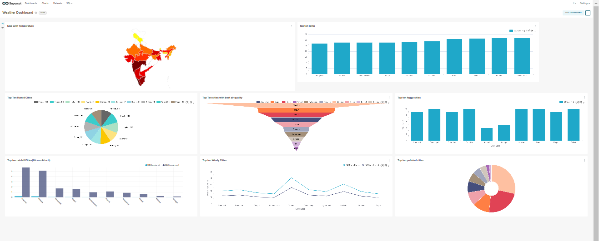
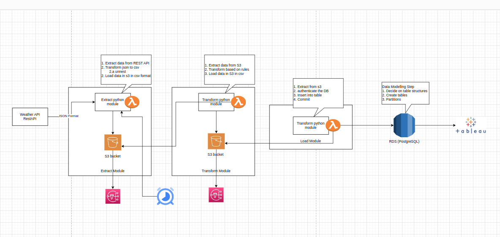

# Weather Dashborard 
```sh
BY: Varun Sharma
```
A dynamic weather dashboard showcasing comprehensive information on rainfall, humidity, and air quality for various states in the country.
- Designed and implemented a dynamic weather dashboard showcasing comprehensive information on rainfall,humidity, and air quality for various states in the country.
- Developed the architectural framework using AWS cloud services, ensuring scalability, reliability, and cost-effectiveness.
- Automated the entire data flow using an ETL framework, minimizing human intervention and enhancing efficiency.
- Implemented a robust data extraction process from a weather REST API, utilizing AWS Lambda functions and storing code as Docker images in Elastic Container Registry (ECR).
- Established a seamless data ingestion process by fetching data in batch and storing it in AWS S3 with partitioning based on date for efficient data management.
- Engineered a Lambda function to trigger the ingestion of data from S3 directly into an AWS RDS (Postgres), ensuring real-time updates and accessibility.
- Conducted data modelling for JSON-formatted API data, optimizing storage and retrieval processes for enhanced performance.
- Integrated Tableau with the AWS RDS, creating a visually compelling and user-friendly dashboard to provide stakeholders with actionable insights.

## Dashboard


## Features

- Current Weather: Get instant access to the latest weather conditions, including temperature, humidity, wind speed, and more. This dashboard ensures you're always in the know about the current atmospheric conditions.
- Forecast: Plan ahead with our detailed weather forecasts. This will provide daily forecasts, allowing you to make informed decisions based on predicted weather patterns.
- Air Quality Index: Stay aware of your surroundings with daily air quality data. This dashboard includes Air Quality Index (AQI) information, helping you gauge the quality of the air you breathe.
- Customization: Tailor the dashboard to your preferences. Choose your favorite locations, set temperature units, and personalize your weather-viewing experience.
- Informative Visuals: This dashboard features visually appealing charts, graphs, and maps to enhance your understanding of weather patterns.

## Architecture of the Dashboard



## Tech

Weather Dashboard uses number of technologies(either open source):

- [API] - To fetch the data(weatherAPI.com)
- [Python] - programs to fetch, engineer and push data.
- [Docker] - containerized the program & its dependencies.
- [AWS ECR] - storing code as Docker images
- [AWS S3] - to store the processed CSV files.
- [AWS Lambda] - Used to trigger the program.
- [AWS RDS] - To store the processed data
- [VScode] - To write programs
- [Apache-Superset] - For making DashBoard
- 
## AWS(ECR) Push Commands
1) Retrieve an authentication token and authenticate your Docker client to your registry.
Use the AWS CLI:
```sh
aws ecr get-login-password --region ap-south-1 | docker login --username AWS --password-stdin 640129200076.dkr.ecr.ap-south-1.amazonaws.com
```
2) Build your Docker image using the following command. For information on building a Docker file from scratch see the instructions here . You can skip this step if your image is already built:
```sh
docker build -t weather_api_load .
```
3) After the build completes, tag your image so you can push the image to this repository:
```sh
docker tag weather_api_load:latest 640129200076.dkr.ecr.ap-south-1.amazonaws.com/weather_api_load:latest
```
4) Run the following command to push this image to your newly created AWS repository:
```sh
docker push 640129200076.dkr.ecr.ap-south-1.amazonaws.com/weather_api_load:latest
```
